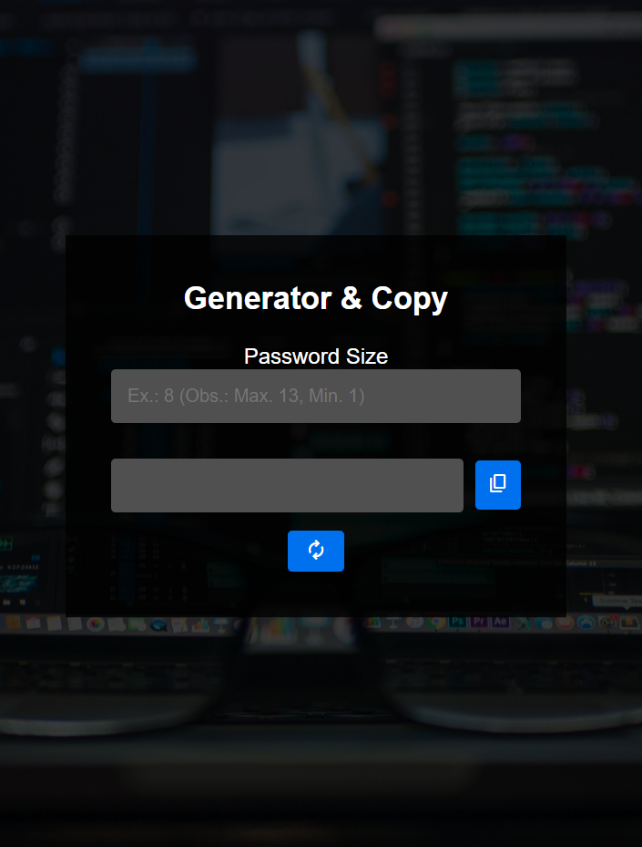

<h1 align="center"> Password Generator Project </h1>

I did this project in the video on the DEVenvolvente channel.

  <a href="#-technologies">Technologies</a>&nbsp;&nbsp;&nbsp;|&nbsp;&nbsp;&nbsp;
  <a href="#-project">Project</a>&nbsp;&nbsp;&nbsp;|&nbsp;&nbsp;&nbsp;
  <a href="#-license">License</a>

  

 

  

## 🚀 Technologies

This project are made with these technologies:

- JavaScript
- HTML
- CSS
- Git e Github
- Figma

## 💻 Project

The Password Generator Project is a generetor when you click on the generate button and it's criated a new password for you, if you click on the copy button the password is copy for your transfer area. Access the project [HERE](https://yuriverwiebe.github.io/password-generator)
 
 

## 📝 License

This project is under the MIT License.

---

Made with ♥ by Yuri Verwiebe 🌊
